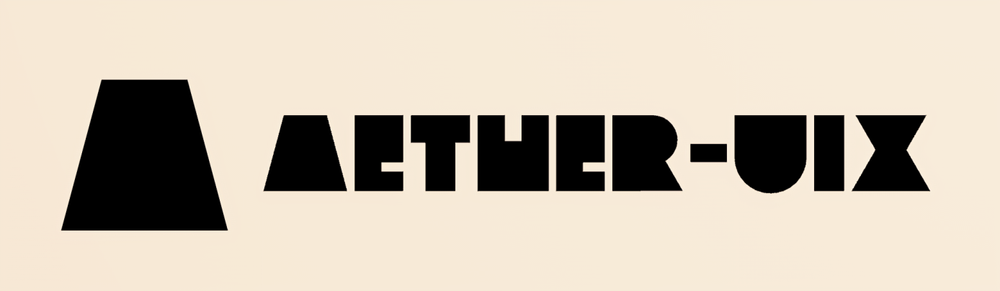

# Aether-UIX



🚀 **Aether-UIX** is a cutting-edge frontend framework designed to deliver high-performance, scalable, and maintainable UI solutions. Built for modern web applications, it provides an intuitive API, seamless reactivity, and optimized rendering techniques to enhance developer productivity and user experience.

## ✨ **Key Features**

- **Declarative UI Rendering**: Write expressive UI components with a clean and structured approach.
- **Reactive Data Binding**: Efficient state management ensures seamless synchronization between data and UI.
- **Virtual DOM Optimization**: Faster updates with a diffing algorithm that minimizes unnecessary re-renders.
- **Modular Component System**: Easily reusable components with encapsulated logic and styles.
- **Lightning-Fast Performance**: Optimized compilation and rendering pipeline for snappy UI interactions.
- **Intuitive Routing**: Built-in routing system for effortless navigation in single-page applications.
- **Scoped Styling**: Modular CSS and scoped styles to prevent conflicts and improve maintainability.
- **TypeScript Support**: Fully compatible with TypeScript for better developer experience and code safety.
- **Lightweight and Scalable**: Minimal runtime overhead with a focus on scalability and maintainability.
- **Seamless SSR (Server-Side Rendering)**: Enhanced SEO and faster load times with out-of-the-box SSR support.

## 📦 **Installation**

Install Aether-UIX using npm or yarn:

```sh
npm install aether-uix
```

or

```sh
yarn add aether-uix
```

## 🚀 **Getting Started**

Create your first Aether-UIX component:

```javascript
import { createComponent } from 'aether-uix';

const App = createComponent(() => {
  let count = 0;

  return () => (
    <div>
      <h1>Hello, Aether-UIX!</h1>
      <p>Counter: {count}</p>
      <button onclick={() => count++}>Increment</button>
    </div>
  );
});

export default App;
```

## 🔗 **Routing Example**

Aether-UIX comes with built-in routing capabilities:

```javascript
import { createRouter } from 'aether-uix';

const router = createRouter([
  { path: '/', component: Home },
  { path: '/about', component: About },
]);

export default router;
```

## 🛠 **Customization & Theming**

Aether-UIX supports customizable themes and global styles:

```javascript
import { setTheme } from 'aether-uix';

setTheme({
  primaryColor: '#4CAF50',
  secondaryColor: '#FFC107',
  fontFamily: 'Arial, sans-serif',
});
```

## 🚀 **Future Directions**

### Production Optimizations
- **Minified and Tree-Shaken Builds**: Implement proper build optimizations to remove unused code and reduce bundle size.
- **SSR Hydration Improvements**: Optimize server-rendered content hydration for faster page loads.
- **Code-Splitting and Lazy Loading**: Implement dynamic imports for components to reduce initial load times.
- **Memoization & Re-Renders Optimization**: Improve performance by implementing better memoization and state reconciliation strategies.
- **Better Error Handling**: Introduce error boundaries, logging, and debugging tools for better DX.

### Routing Enhancements
- **Dynamic Route Matching**: Improve the router to support parameterized and wildcard routes.
- **Nested Routes & Layouts**: Enable support for multi-level routing and layout components.
- **Prefetching & Route Guards**: Implement preloading of important routes and guards for authentication and authorization.

### Enhanced Developer Experience
- **CLI Tooling**: Develop an official CLI to scaffold projects and generate components.
- **TypeScript Improvements**: Expand TypeScript support with better typings and strict mode compatibility.
- **Better State Management**: Explore advanced reactivity features to handle complex application state efficiently.
- **Hot Module Replacement (HMR)**: Enable fast development workflows with instant updates.
- **Testing Utilities**: Introduce built-in utilities for unit and integration testing of components.

## 🏗 **Contributing**

We welcome contributions from the community! Feel free to fork the repository, open issues, or submit pull requests.

## 📜 **License**

Aether-UIX is licensed under the MIT License.

---

🚀 **Build scalable, high-performance UIs with Aether-UIX!**

